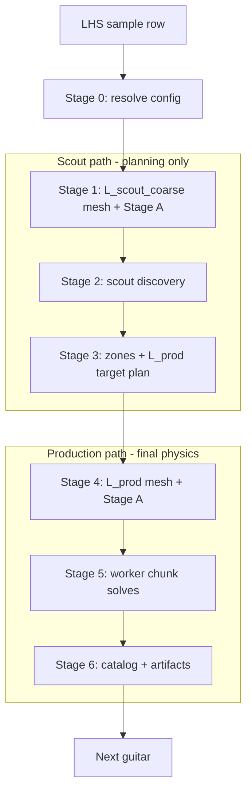

# B3 M4 — Full LHS pipeline orchestrator contract (planning / architecture)

**Status:** M4.0 specification — **planning and architecture only**.  
**No** full-pipeline implementation, **no** Stage A/B/C execution, **no** cleanup, **no** production promotion in this milestone.

**Extends:** [`B3_M3_ORCHESTRATOR_CONTRACT.md`](B3_M3_ORCHESTRATOR_CONTRACT.md), [`B3_M3_4_COARSE_MESH_MODAL_DENSITY_SCOUT_PLAN.md`](B3_M3_4_COARSE_MESH_MODAL_DENSITY_SCOUT_PLAN.md), [`B3_M3_4_PRE_COARSE_FREQUENCY_PLANNER.md`](B3_M3_4_PRE_COARSE_FREQUENCY_PLANNER.md), [`B3_M1_PIPELINE_RUN_MANIFEST_SPEC.md`](B3_M1_PIPELINE_RUN_MANIFEST_SPEC.md)

**Supersedes as “final goal”:** M3.3 single-sample timing orchestration and M3.4 overnight scout batch experiments. Those remain **validated building blocks**; M4 is the **pipeline brain** that chains them per guitar.

---

## 1. Purpose and scope

### 1.1 Purpose

Define the **end-to-end simulation pipeline** for production LHS guitar studies:

```text
LHS guitar sample
  → resolved physics config + meshes
  → coarse scout (modal-density discovery)
  → adaptive L_prod target plan (zones 6 / 9 / 12.5 Hz)
  → parallel L_prod worker solves (chunk queue, FCFS)
  → aggregation, dedupe, catalog, plots, provenance
  → next sample
```

The orchestrator is the **brain**: it plans paths, schedules work, enforces environment isolation, tracks manifests, and never silently overwrites PASS artifacts.

### 1.2 In scope (M4 contract)

| Area | M4 responsibility |
|------|-------------------|
| Per-guitar stage graph (0–6) | Yes |
| Scout v1 policy (frozen) | Yes |
| Zone policy v1 (3 zones, density-based) | Yes |
| L_prod worker queue / chunking v1 | Yes |
| Directory layout, manifests, provenance | Yes |
| Environment model (prod vs solver-mkl) | Yes |
| Safety, retry, dry-run | Yes |
| Runtime estimation model | Yes |
| Implementation milestones M4.1–M4.5 | Yes |

### 1.3 Out of scope (this document)

| Area | Deferred |
|------|----------|
| Implementing the orchestrator code | M4.2+ |
| Scout mesh optimization | Later |
| ZONE 3+ / transition zones | Later |
| Stage C / rich modal / synthesis default | Opt-in later |
| Automatic cleanup / promotion | Explicit separate approval |
| MAC-based branch tracking across meshes | Later catalog enhancement |

### 1.4 Design stance: scout v1 is “good enough”

Do **not** over-optimize scout accuracy now. Scout v1 exists to:

- run **once per guitar** at the start of simulation (geometry/material may change every LHS draw),
- produce **adaptive zone information** for L_prod targeting,
- save **accumulated** wall time over many guitars vs uniform fine spacing on `L_prod`.

Frozen scout discovery parameters (v1):

| Parameter | Value |
|-----------|--------|
| Mesh level | `L_scout_coarse` |
| Frequency band | **60–550 Hz** |
| Target spacing | **7.5 Hz** |
| Discovery half-width | **3.75 Hz** (= spacing / 2) |
| Discovery mode | **enabled** (`--B3-discovery-mode`, band 60–550) |

Scout mesh controls (v1, per sample geometry):

| Control | m |
|---------|---|
| `wood_thickness_size_m` | 0.003 |
| `wood_surface_size_m` | 0.0085 |
| `air_threshold_size_min_m` | 0.011 |
| `air_threshold_size_max_m` | 0.055 |

`L_prod` mesh remains the **final physics** path (manifest `L_prod` / FOM controls).

---

## 2. End-to-end flow

### 2.1 Per-guitar pipeline (ordered stages)

```text
Stage 0  Resolve sample config (geometry, materials, mesh paths, readiness)
Stage 1  Scout mesh build + Stage A scout checkpoint
Stage 2  Scout discovery (60–550, 7.5 Hz, discovery mode)
Stage 3  Density zones + L_prod target plan (6 / 9 / 12.5 Hz, gapless)
Stage 4  L_prod mesh build + Stage A production checkpoint
Stage 5  L_prod worker solve (chunk queue, FCFS, N workers)
Stage 6  Aggregate, dedupe, catalog, plots, simulation manifest
```

### 2.2 Flow diagram



### 2.3 LHS sample classes

| Class | Geometry | Scout mesh | L_prod mesh |
|-------|----------|------------|-------------|
| **Material-only** | Fixed baseline CAD | Shared or regenerated scout (policy: regenerate if cheap enough; v1 may reuse fixed geometry scout mesh) | One `L_prod` mesh per study or per sample if materials affect mesh gates only |
| **Full geometry/material** | Per-sample LHS geometry | **New `L_scout_coarse` per sample** | **New `L_prod` per sample** |

**v1 default for real LHS:** treat every sample as needing **sample-specific** scout and L_prod meshes when any geometry field in the manifest case differs from baseline. Material-only pilots may share geometry mesh filenames but still get **sample-specific** resolved configs and checkpoints.

---

## 3. Data model

### 3.1 Identifiers

| ID | Scope | Example | Rules |
|----|--------|---------|-------|
| `sample_id` | Logical LHS guitar identity | `lhs_00042` | Stable across retries; keys overlay dir |
| `run_id` | One orchestrated execution | `lhs_00042_m4_20260603T120000Z` | Keys all mutable run roots; new run on retry |
| `guitar_index` | Batch position | `42` | Optional, for reporting |
| `chunk_id` | Worker work unit | `lhs_00042_chunk_03` | Unique within run |
| `worker_id` | Solver process slot | `W0`, `W1` | FCFS consumer |

**Rule (from M3):** output paths use **`run_id`**, not `sample_id` alone. Overlays remain `config_overlays/<sample_id>/` or `config_overlays/<sample_id>_<run_suffix>/` per M4 layout below.

### 3.2 Sample input (LHS row)

Minimum fields the pipeline must accept (extensible JSON / JSONL):

```json
{
  "sample_id": "lhs_00042",
  "shape_name": "Classical",
  "top_wood_id": "spruce",
  "back_wood_id": "rosewood",
  "geometry": {
    "length": 0.48,
    "width": 0.325,
    "depth": 0.1,
    "top_thickness": 0.003,
    "back_thickness": 0.0033,
    "hole_radius": 0.047
  },
  "material_delta": {},
  "geometry_delta": {},
  "requires_mesh_regeneration": true
}
```

Wood assignment may be expressed as `top_wood_id` / `back_wood_id` (resolved via `wood_library` at Stage 0) or explicit `materials` blocks in resolved config.

### 3.3 Scout artifact bundle

| Artifact | Description |
|----------|-------------|
| `scout_mesh_path` | `mesh/L_scout_coarse/<case_id>.msh` (per-sample path under run) |
| `scout_checkpoint_dir` | Stage A export on scout mesh |
| `density_result.json` | Stage B target-density experiment output |
| `scout_density_report.json` | 25 Hz (or configurable) binned density + per-bin zone candidate |

### 3.4 Zone and target plan

**Density definition (v1):**

```text
density_hz = mode_count_in_bin / bin_width_hz
```

Use **actual bin width** (e.g. 25 Hz windows), not a nominal label only.

**Zone policy v1 (exactly three zones):**

| Zone | Meaning | L_prod target spacing (Hz) |
|------|---------|----------------------------|
| **ZONE 1** | dense | **6.0** |
| **ZONE 2** | medium | **9.0** |
| **ZONE 3** | sparse | **12.5** |

**Classification (v1, relative — calibrate after first scout cohort):**

- Compute `density_hz` per bin over 60–550 Hz.
- Rank bins or use tertiles vs median density.
- Map contiguous frequency intervals to ZONE 1/2/3.
- **No ZONE 3+**, no transition sub-zones in v1.

**Gapless L_prod target plan:**

For each zone segment `[f_lo, f_hi]` with spacing `s`:

- Targets: `f_lo`, `f_lo + s`, …, `f_hi` (endpoints included).
- Discovery / acceptance window half-width: **`s / 2`** (default), so adjacent targets have touching windows.
- Planner must **verify** union of windows covers `[60, 550]` with no gaps > tolerance (e.g. 0.01 Hz).

Outputs:

- `density_zones.json` — segments with zone, spacing, bin stats
- `lprod_target_plan.json` — ordered `targets_hz`, per-target metadata (zone, spacing, half_width)

### 3.5 Worker chunk

```json
{
  "chunk_id": "lhs_00042_chunk_03",
  "freq_lo_hz": 180.0,
  "freq_hi_hz": 220.0,
  "zone_segments": ["ZONE2"],
  "targets_hz": [180.0, 189.0, 198.0, ...],
  "target_count": 5,
  "status": "PENDING",
  "assigned_worker": null,
  "priority": 0
}
```

Chunker v1 constraints:

| Constraint | Value |
|------------|--------|
| Preferred chunk width | **20–40 Hz** |
| Minimum chunk width | **~15 Hz** |
| Maximum chunk width | **~50 Hz** |
| Full band coverage | **60–550 Hz** contiguous |
| Zone boundaries | Respect when practical; split wide zones; merge tiny adjacent segments |

### 3.6 Worker result

```json
{
  "worker_id": "W1",
  "chunk_id": "lhs_00042_chunk_03",
  "status": "PASS",
  "freq_range_hz": [180.0, 220.0],
  "targets_hz": [],
  "accepted_modes": [],
  "unique_modes_hz": [],
  "timing": {"wall_s": 0, "st_s": 0},
  "solver": {"factor_solver": "mkl_pardiso"},
  "result_json": "worker_results/chunk_03/result.json",
  "warnings": []
}
```

### 3.7 Final guitar bundle

| Artifact | Role |
|----------|------|
| `simulation_manifest.json` | Terminal state, stage timeline, hashes |
| `modes_catalog.jsonl` | One record per deduped mode |
| `modes_summary.json` | Counts, bands, zone replay stats |
| `modes_active.npz` / `modal_data.npz` | Numerical modes (format TBD M4.4) |
| `mode_frequency_plot.png` | QC plot |
| `runtime_summary.json` | Uniform vs adaptive estimates vs measured |
| `warnings_and_failures.json` | Non-fatal issues |

---

## 4. Directory and output layout

Root (experiment):

`FEM/experiments/active_domain_validation/physics_integrity/`

### 4.1 Per-guitar run tree (authoritative)

```text
pipeline_runs/guitars/<sample_id>/runs/<run_id>/
  sample_manifest.json              # Stage 0
  resolved_core_config.json
  readiness_check.json
  overlay_applied.json

  scout/
    mesh/L_scout_coarse/<case_id>.msh
    mesh_build_summary.json
    checkpoint/                     # Stage A scout
      checkpoint_export_manifest.json
      built_metadata.json
      ...
    discovery/                    # Stage 2
      density_result.json
      density_result.md
    reports/
      scout_density_report.json
      scout_density_report.md
      density_zones.json
      density_zones.md
      lprod_target_plan.json
      lprod_target_plan.md

  lprod/
    mesh/L_prod/<case_id>.msh
    mesh_build_summary.json
    checkpoint/                     # Stage 4
      ...
    worker_plan/
      worker_chunks.json
    worker_results/
      chunk_<chunk_id>/
        result.json
        manifest.json
        log.txt
    aggregation/                    # Stage 6
      modes_catalog.jsonl
      modes_summary.json
      modes_active.npz
      mode_frequency_plot.png

  logs/
    stage0_resolve.log
    stage1_scout_mesh.log
    stage1_scout_export.log
    stage2_scout_discovery.log
    ...
    worker_W0.log
    worker_W1.log

  simulation_manifest.json        # terminal
  runtime_summary.json
  warnings_and_failures.json
```

### 4.2 Batch-level indices

```text
pipeline_runs/lhs_batches/<batch_id>/
  batch_spec.jsonl
  batch_plan.json                 # dry-run
  batch_manifest.json
  runs_index.jsonl                # append-only index rows
  summary/
    batch_runtime_summary.json
    batch_zone_consensus.json     # optional cross-guitar
```

### 4.3 Legacy / convergence paths (read-only references)

Existing tools may continue to write under:

- `v2_mesh_convergence/mesh/<level>/`
- `v2_mesh_convergence/diagnostics/`
- `pipeline_runs/config_overlays/<sample_id>/`

**M4 orchestrator** should prefer **`pipeline_runs/guitars/...`** as the canonical per-guitar tree. Symlinks or copy-in manifests may point to convergence paths for backward compatibility during transition.

---

## 5. Environment model

Reuse M3.3 + scout batch lessons: **never rely on parent shell `VIRTUAL_ENV`.**

### 5.1 Stage classes

| Stage class | Python | Environment |
|-------------|--------|-------------|
| Mesh build (Gmsh), Stage 0 resolve, Stage A export | `/home/vboxuser/final-project/.venv/bin/python` | **Production strict:** `VIRTUAL_ENV=~/final-project/.venv`, `PATH=<prod>/bin:…`, system `PETSC_DIR` / `SLEPC_DIR`, `PYTHONPATH` = system petsc+slepc dist-packages |
| Stage B discovery, worker solves | `/home/vboxuser/solver-mkl/venv/bin/python` | **Solver-mkl strict:** `VIRTUAL_ENV=~/solver-mkl/venv`, `PATH=<solver>/bin:…`, **unset** `PYTHONPATH`, `PETSC_DIR`, `SLEPC_DIR`, `PYTHONHOME` |

### 5.2 Mandatory probes

Before first Stage A and first Stage B of a run (or once per batch with logged attestation):

| Probe | Must confirm |
|-------|----------------|
| Stage A | `sys.executable` = prod python; `petsc4py` from system petsc; `dolfinx` + `mpi4py` importable; `VIRTUAL_ENV` = prod `.venv` (no `solver-mkl`) |
| Stage B | `sys.executable` = solver python; `petsc4py` / `slepc4py` under solver venv; `dolfinx` **not** importable; `VIRTUAL_ENV` = solver-mkl |

Log probes under `logs/` and record PASS/FAIL in `simulation_manifest.json`.

### 5.3 Subprocess contract

Every subprocess receives an **explicit `env` dict** built by `_prod_subprocess_env_strict` / `_solver_mkl_subprocess_env_strict` (see `v2_b3_run_coarse_scout_lhs_batch.py`). No `os.environ` copy for Stage A.

---

## 6. Worker scheduling model

### 6.1 Roles

| Role | Responsibility |
|------|----------------|
| **Orchestrator (brain)** | Plan chunks, maintain queue, assign work, track PASS/FAIL, aggregate |
| **Worker** | Pull chunk assignment, run ST solves for `targets_hz` in chunk, write `result.json`, signal done |

### 6.2 FCFS queue

```text
1. Build ordered chunk list from lprod_target_plan + chunker v1.
2. Initialize queue with all PENDING chunks.
3. For each idle worker:
     pop next PENDING chunk (FCFS / stable order)
     assign → RUNNING
4. Worker completes:
     if PASS → mark chunk PASS; merge modes into run-level buffer
     if FAIL → mark chunk FAIL; apply retry policy
5. Repeat until queue empty or fatal abort.
6. Stage 6 aggregation when all required chunks PASS (or partial policy).
```

### 6.3 Parallelism

| `worker_count` | Model |
|----------------|--------|
| 1 | Sequential chunks (debug) |
| 2–3 | Independent subprocesses; shared read-only checkpoint; **separate output dirs per chunk** |
| N>3 | v1 cap recommended at **3** unless measured safe on VM |

Workers must **not** write the same `result.json` path. Checkpoint is read-only after Stage 4 PASS.

### 6.4 Idempotency

| Condition | Behavior |
|-----------|----------|
| Chunk `result.json` exists and PASS | **Skip** chunk unless `--force` |
| Chunk FAIL | New attempt gets new `chunk_attempt_id` subdir or new `run_id` |
| Stage A/B PASS paths exist | Skip stage unless `--force` |

---

## 7. Zone and spacing policy v1 (normative)

### 7.1 Scout → bins

| Setting | v1 value |
|---------|----------|
| Planning band | 60–550 Hz |
| Scout discovery spacing | 7.5 Hz |
| Scout half-width | 3.75 Hz |
| Density bin width (reporting) | 25 Hz (configurable; use actual width in formula) |

### 7.2 Scout → zones

1. Deduplicate accepted frequencies (tolerance e.g. **0.05 Hz**).
2. Bin into `[60, 85)`, `[85, 110)`, … (last bin closed at 550).
3. `density_hz = count / (bin_hi - bin_lo)`.
4. Classify each bin → ZONE 1 / 2 / 3 (relative thresholds; document chosen rule in `density_zones.json`).
5. Merge adjacent bins with same zone into **segments** covering 60–550 without gaps.

### 7.3 Zones → L_prod targets

| Zone | Spacing `s` (Hz) | Half-width (Hz) |
|------|------------------|-----------------|
| ZONE 1 | 6.0 | 3.0 |
| ZONE 2 | 9.0 | 4.5 |
| ZONE 3 | 12.5 | 6.25 |

**Coverage check (required):** for every segment, verify windows `[f_target - s/2, f_target + s/2]` cover segment; union over full band covers [60, 550].

### 7.4 Chunking for workers

Input: ordered target list with zone tags.

1. Group targets by contiguous zone segments in frequency.
2. Pack targets into chunks targeting **20–40 Hz** width (by frequency span, not target count).
3. If segment > 50 Hz, split at zone-friendly boundaries.
4. If segment < 15 Hz, merge with neighbor same zone if possible.
5. Emit `worker_chunks.json` with explicit `targets_hz` per chunk.

---

## 8. Safety and retry policy

| Rule | Policy |
|------|--------|
| Overwrite PASS | **Forbidden** unless `--force` |
| Failed run | New `run_id` or explicit failed subdir; never clobber PASS |
| Provenance | SHA256 on configs, meshes, checkpoints; store in manifests |
| Dry-run | Full argv + env + dir plan; `will_execute=false` |
| Logs | Per stage, per worker, per probe |
| Terminal manifest | `simulation_manifest.json` updated only at terminal state |
| Cleanup | **Separate explicit command**; never automatic |
| Continue on fail | Configurable per batch (`--continue-on-fail`); default **false** for M4.5 production batch |
| Partial chunk FAIL | Mark guitar `PARTIAL`; aggregation includes only PASS chunks unless policy says abort |

**Retry:**

- Stage A/B scout: retry with new `run_id` suffix `_retryN`.
- Worker chunk: max **2** retries per chunk v1, then mark `FAILED_PERMANENT`.
- Do not auto-retry on env probe failure.

---

## 9. Runtime estimation model

Configurable defaults (override in `runtime_summary.json` inputs):

| Parameter | Default | Notes |
|-----------|---------|-------|
| `lprod_target_time_s` | **95** | Per-target ST wall time on L_prod ~316k DOF class |
| `worker_count` | **1 / 2 / 3** | Report table for each |
| `uniform_spacing_hz` | **5.5** | Baseline over 60–550 |
| `adaptive_spacings_hz` | **6 / 9 / 12.5** | Zone policy v1 |
| `scout_overhead_s` | **measured** | Stage 0–3 per sample from logs |

**Formulas:**

```text
N_uniform   = count_targets(60, 550, step=5.5)
T_uniform   = N_uniform * lprod_target_time_s / worker_count

N_adaptive  = sum over zone segments count_targets(segment, zone_spacing)
T_adaptive  = N_adaptive * lprod_target_time_s / worker_count

T_scout     = T_mesh_scout + T_stageA_scout + T_discovery_scout   # measured
T_total     = T_scout + T_adaptive + T_stageA_lprod + T_agg
saving      = T_uniform - (T_scout + T_adaptive)   # interpret per guitar
```

Reports must show **target counts** and **estimated hours** for uniform vs adaptive and scout overhead.

---

## 10. What exists today (M3.4 and earlier)

| Capability | Status | Location |
|------------|--------|----------|
| Per-sample overlay resolver (material delta) | **Done** | `v2_b3_resolve_pilot_core_config.py` |
| M3.3 single-sample orchestrator (L_prod, full9, A+B) | **PASS** | `v2_b3_m3_orchestrator_run_one.py` |
| Strict prod / solver-mkl env isolation | **Done** | M3.3 + `v2_b3_run_coarse_scout_lhs_batch.py` |
| `L_scout_coarse` manifest + explicit mesh controls | **Done** | `v2_mesh_convergence_manifest.json` |
| Scout mesh build script | **Done** | `run_v2_B3_scout_coarse_mesh_build.py` |
| Stage A `L_scout_coarse` allowlist | **Done** | `v2_b3_checkpoint_export.py` |
| Gate A discovery mode (60–550) | **Done** | `v2_b3_st_sinvert_solver_lib.py`, target-density experiment |
| Scout dry-run planner | **Done** | `v2_b3_coarse_mesh_scout_plan.py` |
| Overnight scout LHS batch (5 samples, A+B discovery, zone reports) | **In progress / partial** | `v2_b3_run_coarse_scout_lhs_batch.py` |
| Coarse frequency planner (target grid math) | **Dry-run** | `v2_b3_frequency_coarse_planner.py` |
| Pipeline run manifest spec | **Done** | `B3_M1_PIPELINE_RUN_MANIFEST_SPEC.md` |
| M3 orchestrator contract | **Done** | `B3_M3_ORCHESTRATOR_CONTRACT.md` |

**Not yet a single “guitar brain”:**

- No Stage 3 → chunker → worker queue → Stage 6 aggregation in one orchestrator.
- No canonical `pipeline_runs/guitars/<sample_id>/runs/<run_id>/` tree enforced.
- No `worker_chunks.json` / FCFS worker pool.
- No final `modes_catalog.jsonl` / NPZ export path in pipeline.
- Geometry-varying LHS auto mesh pipeline not wired end-to-end.

---

## 11. What is missing before implementation

| Gap | M4 milestone |
|-----|----------------|
| Normative JSON schemas (`sample_manifest`, `density_zones`, `lprod_target_plan`, `worker_chunks`, `simulation_manifest`) | **M4.1 done** |
| Full-pipeline dry-run planner (prints stage commands, no exec) | **M4.2 done** — `v2_b3_m4_pipeline_dry_run.py` |
| Stage 3 zone + gapless target planner module | **M4.3 done** — `v2_b3_m4_scout_planner_lib.py` |
| Single-guitar orchestrator Stages 0–3 (scout path) | **M4.3 done** — `v2_b3_m4_pipeline_run_scout.py` |
| L_prod worker execution dry-run planner | **M4.4-pre done** — `v2_b3_m4_lprod_worker_dry_run.py` |
| L_prod execution interfaces + dry-run validation | **M4.4.1a done** — see §12 M4.4.1a |
| L_prod mesh + checkpoint only (Stage 4) | **M4.4.1b-0 done** — `v2_b3_m4_lprod_checkpoint_run.py` |
| Single-chunk worker smoke (solver-mkl) | **M4.4.1b-1 done** — `v2_b3_m4_worker_smoke_test.py` |
| Limited multi-chunk worker mini-batch | **M4.4.1b-2 done** — `v2_b3_m4_worker_minibatch.py` |
| Single-guitar L_prod worker solve + aggregation | M4.4.1b |
| Multi-guitar LHS batch driver | M4.5 |
| Geometry-delta → remesh trigger in Stage 0 | M4.3+ |
| Mode NPZ / plot exporters | M4.4 |
| Cross-guitar batch dashboard | M4.5+ |

**Dependencies:**

- Scout batch env fix validated on VM (strict env).
- At least one **PASS** scout discovery on `L_scout_coarse` per geometry class before calibrating zone thresholds.

---

## 12. Proposed implementation milestones

### M4.1 — Contract + schemas

- Publish this document.
- Add `schemas/` or doc-embedded JSON Schema for: `sample_manifest`, `density_zones`, `lprod_target_plan`, `worker_chunk`, `worker_result`, `simulation_manifest`.
- Version policies: `zone_policy_version=v1`, `scout_policy_version=v1`, `chunk_policy_version=v1`.

**Exit:** Schemas validate example fixtures; no execution.

### M4.2 — Dry-run planner (**done**)

- Script: `scripts/v2_b3_m4_pipeline_dry_run.py`
- Input: single sample JSON (`--sample-json`), `--run-id`, frequency/zone flags, `--workers`
- Writes: `pipeline_runs/guitars/<sample_id>/runs/<run_id>/` with `sample/`, `scout/`, `lprod/`, `worker_results/`, `aggregation/`, `logs/`, `pipeline_run_manifest.json`, `dry_run_summary.md`
- All artifacts: `will_execute=false`; targets `pending_scout`; chunks `pending_target_plan`
- Refuses `--no-dry-run`; existing run dir requires `--force`

**Example:**

```bash
python FEM/experiments/active_domain_validation/physics_integrity/scripts/v2_b3_m4_pipeline_dry_run.py \
  --sample-json FEM/experiments/active_domain_validation/physics_integrity/pipeline_runs/schemas/m4/examples/sample_input.example.json \
  --run-id sample_001_m4dry1 \
  --freq-min-hz 60 --freq-max-hz 550 \
  --scout-spacing-hz 7.5 --scout-half-width-hz 3.75 \
  --zone-spacing-dense-hz 6 --zone-spacing-medium-hz 9 --zone-spacing-sparse-hz 12.5 \
  --workers 3 --dry-run --force
```

**Exit:** Operator can review one guitar plan without running solvers. See `B3_M4_SCHEMA_CONTRACTS.md`.

### M4.3 — Single-guitar scout → target plan (**done**)

- Script: `scripts/v2_b3_m4_pipeline_run_scout.py` (+ `v2_b3_m4_scout_planner_lib.py`)
- Stages 0–3: resolve, `L_scout_coarse` mesh + Stage A, discovery (7.5 Hz / 3.75 Hz), percentile zones, gapless target plan, chunk preview
- Strict prod / solver-mkl env probes; reuse PASS artifacts unless `--force`
- No L_prod execution

**Preview:**

```bash
python FEM/experiments/active_domain_validation/physics_integrity/scripts/v2_b3_m4_pipeline_run_scout.py \
  --run-dir FEM/experiments/active_domain_validation/physics_integrity/pipeline_runs/guitars/sample_001/runs/sample_001_m4dry1 \
  --dry-run
```

**Execute:**

```bash
python FEM/experiments/active_domain_validation/physics_integrity/scripts/v2_b3_m4_pipeline_run_scout.py \
  --run-dir FEM/experiments/active_domain_validation/physics_integrity/pipeline_runs/guitars/sample_001/runs/sample_001_m4dry1 \
  --execute-scout
```

**Exit:** `SCOUT_PASS_TARGET_PLAN_READY` with gapless `lprod/lprod_target_plan.json` from real scout modes.

### M4.4-pre — L_prod worker dry-run plan (**done**)

- Script: `scripts/v2_b3_m4_lprod_worker_dry_run.py`
- Input: completed M4.3 run (`SCOUT_PASS_TARGET_PLAN_READY`)
- Plans Stage 4 mesh/checkpoint, Stage 5 per-chunk solver commands, Stage 6 aggregation, FCFS schedule (workers 1/2/3)
- Documents solver gap: interim `v2_b3_checkpoint_solve.py --targets-hz`; planned `v2_b3_checkpoint_solve_target_list.py --targets-json`
- `will_execute=false`; writes `pipeline_run_manifest.m4_4_dry_run_preview.json` (does not overwrite main manifest)

```bash
python FEM/experiments/active_domain_validation/physics_integrity/scripts/v2_b3_m4_lprod_worker_dry_run.py \
  --run-dir FEM/experiments/active_domain_validation/physics_integrity/pipeline_runs/guitars/sample_001/runs/sample_001_m4dry1 \
  --workers 3 --dry-run --force
```

### M4.4.1a — L_prod execution interfaces + dry-run validation (**done**)

- Scripts:
  - `v2_b3_checkpoint_solve_target_list.py` — `--targets-json` with per-target `window_hz` (`m4_worker_chunk_targets_v1`); `--dry-run` writes placeholders
  - `v2_b3_m4_lprod_worker_dry_run.py` (extended) — mesh/checkpoint readiness, per-chunk `chunk_targets.json`, `worker_command.sh`, dry-run `worker_result.json` / `solver_result.json`
  - `v2_b3_m4_aggregation_dry_run.py` — validates chunk assignment and aggregation paths
  - `v2_b3_m4_lprod_interfaces.py` — shared geometry fingerprint, chunk targets, placeholders
- `lprod_mesh_status`: `reusable_existing` | `planned_build_required` | `blocked` (geometry hash vs `baseline_coupled_v2`)
- `lprod_checkpoint_status`: `planned` | `existing_pass` | `blocked`
- `will_execute=false` on all new artifacts; no L_prod mesh, checkpoint, or worker solves

```bash
python -m py_compile FEM/experiments/active_domain_validation/physics_integrity/scripts/v2_b3_checkpoint_solve_target_list.py
python -m py_compile FEM/experiments/active_domain_validation/physics_integrity/scripts/v2_b3_m4_lprod_worker_dry_run.py
python -m py_compile FEM/experiments/active_domain_validation/physics_integrity/scripts/v2_b3_m4_aggregation_dry_run.py

python FEM/experiments/active_domain_validation/physics_integrity/scripts/v2_b3_m4_lprod_worker_dry_run.py \
  --run-dir FEM/experiments/active_domain_validation/physics_integrity/pipeline_runs/guitars/sample_001/runs/sample_001_m4dry1 \
  --workers 3 --dry-run --force

python FEM/experiments/active_domain_validation/physics_integrity/scripts/v2_b3_m4_aggregation_dry_run.py \
  --run-dir FEM/experiments/active_domain_validation/physics_integrity/pipeline_runs/guitars/sample_001/runs/sample_001_m4dry1 \
  --dry-run
```

**Remaining blockers before M4.4.1b real L_prod:**

| Blocker | M4.4.1b action |
|---------|----------------|
| Sample geometry ≠ baseline (or `requires_mesh_regeneration`) | Run planned L_prod mesh build + Stage A export |
| No `lprod/checkpoint` PASS | Stage A on production `.venv` |
| Worker solves | `v2_b3_checkpoint_solve_target_list.py` without `--dry-run` on solver-mkl |
| Aggregation | Real dedupe/catalog (not dry-run reader) |

### M4.4.1b-0 — L_prod mesh + checkpoint only (**done**)

- Script: `scripts/v2_b3_m4_lprod_checkpoint_run.py`
- Mesh build: `scripts/v2_b3_m4_lprod_mesh_build.py` (sample geometry via `build_3d_guitar.py` / `FEM_ALLOW_FOM`)
- Production `.venv` only; logs `logs/stage4_env_probe.log`, `stage4_lprod_mesh.log`, `stage4_lprod_checkpoint.log`
- Baseline mesh copy only when geometry fingerprint matches; otherwise per-sample L_prod build
- No worker solves, Stage C, or aggregation

```bash
python FEM/experiments/active_domain_validation/physics_integrity/scripts/v2_b3_m4_lprod_checkpoint_run.py \
  --run-dir FEM/experiments/active_domain_validation/physics_integrity/pipeline_runs/guitars/sample_001/runs/sample_001_m4dry1 \
  --dry-run

python FEM/experiments/active_domain_validation/physics_integrity/scripts/v2_b3_m4_lprod_checkpoint_run.py \
  --run-dir FEM/experiments/active_domain_validation/physics_integrity/pipeline_runs/guitars/sample_001/runs/sample_001_m4dry1 \
  --execute
```

**Exit:** `LPROD_CHECKPOINT_READY`, `stage4_lprod_mesh` / `stage4_lprod_export` PASS, Stages 5–6 `PLANNED_READY`.

### M4.4.1b-1 — Single-chunk worker smoke test (**done**)

- Script: `scripts/v2_b3_m4_worker_smoke_test.py`
- One chunk via `v2_b3_checkpoint_solve_target_list.py` (no `--dry-run`), solver-mkl only
- Recommended chunk: `sample_001_chunk_04` (5 targets, ~184–220 Hz)
- Does not change main `pipeline_run_manifest.json` terminal; writes `pipeline_run_manifest.m4_4_worker_smoke_preview.json`

```bash
python FEM/experiments/active_domain_validation/physics_integrity/scripts/v2_b3_m4_worker_smoke_test.py \
  --run-dir FEM/experiments/active_domain_validation/physics_integrity/pipeline_runs/guitars/sample_001/runs/sample_001_m4dry1 \
  --chunk-id sample_001_chunk_04 --dry-run

python FEM/experiments/active_domain_validation/physics_integrity/scripts/v2_b3_m4_worker_smoke_test.py \
  --run-dir FEM/experiments/active_domain_validation/physics_integrity/pipeline_runs/guitars/sample_001/runs/sample_001_m4dry1 \
  --chunk-id sample_001_chunk_04 --execute
```

**Exit:** `WORKER_SMOKE_TEST_PASS` in preview/smoke manifest; `worker_result.status` ∈ {`PASS`, `PASS_WITH_WARNING`}.

### M4.4.1b-2 — Limited multi-chunk worker mini-batch (**done**)

- Script: `scripts/v2_b3_m4_worker_minibatch.py`
- Shared lib: `scripts/v2_b3_m4_worker_run_lib.py`
- Default chunks: `sample_001_chunk_08`, `sample_001_chunk_10`, `sample_001_chunk_11` (skips smoke PASS `chunk_04` unless `--force`)
- Writes `worker_results/minibatch_m4_4_1b_2_manifest.json`, `minibatch_m4_4_1b_2_summary.md`, `pipeline_run_manifest.m4_4_worker_minibatch_preview.json`

```bash
python FEM/experiments/active_domain_validation/physics_integrity/scripts/v2_b3_m4_worker_minibatch.py \
  --run-dir FEM/experiments/active_domain_validation/physics_integrity/pipeline_runs/guitars/sample_001/runs/sample_001_m4dry1 \
  --chunk-ids sample_001_chunk_08,sample_001_chunk_10,sample_001_chunk_11 --dry-run

python FEM/experiments/active_domain_validation/physics_integrity/scripts/v2_b3_m4_worker_minibatch.py \
  --run-dir FEM/experiments/active_domain_validation/physics_integrity/pipeline_runs/guitars/sample_001/runs/sample_001_m4dry1 \
  --chunk-ids sample_001_chunk_08,sample_001_chunk_10,sample_001_chunk_11 --execute
```

### M4.4.1b — Single-guitar L_prod worker solve + aggregation

- Stages 4–6: L_prod mesh, Stage A, FCFS workers (1–3), dedupe, catalog, plot.
- No Stage C by default; no rich modal export in v1.

**Exit:** One guitar complete end-to-end with PASS manifests.

### M4.5 — Multi-guitar LHS batch

- Outer loop over JSONL; `--continue-on-fail`; batch manifest and `runs_index.jsonl`.
- Optional concurrency: **one guitar at a time** v1 (no overlapping guitars on same VM).

**Exit:** N guitars produce N run trees; batch summary reports savings vs uniform 5.5 Hz.

---

## 13. Non-goals (v1)

| Non-goal | Rationale |
|----------|-----------|
| Scout mesh / spacing optimization | Use frozen v1; measure later |
| ZONE 3+ or transition zones | Keep planner simple |
| Automatic cleanup of failed/preview dirs | Safety |
| Stage C / rich modal / synthesis default | Cost and complexity |
| Production promotion (`v2_production_promotion_ready`) | Requires validation gate |
| Replacing `build_3d_guitar.py` or v2 physics | Orchestration only |
| Perfect cross-mesh mode tracking (MAC) | Catalog v1 is frequency-based dedupe |

---

## 14. Stage reference (normative summary)

| Stage | Name | Primary scripts (existing / planned) |
|-------|------|--------------------------------------|
| 0 | Resolve config | `v2_b3_resolve_pilot_core_config.py` → generalized |
| 1 | Scout mesh + A | `run_v2_B3_scout_coarse_mesh_build.py`, `v2_b3_checkpoint_export.py` |
| 2 | Scout discovery | `v2_b3_checkpoint_target_density_experiment.py` |
| 3 | Zones + L_prod plan | **New** planner (extends frequency planner + scout reports) |
| 4 | L_prod mesh + A | `run_v2_mesh_convergence.py` or dedicated L_prod build, `v2_b3_checkpoint_export.py` |
| 5 | Worker solve | **New** worker runner + `v2_b3_checkpoint_solve.py` or ST lib direct |
| 6 | Aggregate | **New** catalog/dedupe/plot |

---

## 15. Acceptance criteria for “pipeline v1 working”

1. One **geometry-varying** and one **material-only** guitar complete Stages 0–6 with terminal `simulation_manifest.json` status **PASS**.
2. `lprod_target_plan` covers **60–550 Hz** with **no gaps** (verified field in JSON).
3. Worker chunks cover all targets exactly once.
4. Env probes pass with parent shell in solver-mkl.
5. `runtime_summary.json` shows adaptive vs uniform target counts and estimates.
6. No PASS artifact overwritten without `--force`.
7. Batch of **≥3** guitars completes with manifest index.

---

## 16. Related documents

- [`B3_M3_4_COARSE_MESH_MODAL_DENSITY_SCOUT_PLAN.md`](B3_M3_4_COARSE_MESH_MODAL_DENSITY_SCOUT_PLAN.md) — scout mesh and discovery
- [`B3_M3_4_PRE_COARSE_FREQUENCY_PLANNER.md`](B3_M3_4_PRE_COARSE_FREQUENCY_PLANNER.md) — spacing / half-width math
- [`B3_M3_4_GATE_A_ACCEPTANCE_DISCOVERY_MODE.md`](B3_M3_4_GATE_A_ACCEPTANCE_DISCOVERY_MODE.md) — discovery flags
- [`B3_M1_PIPELINE_RUN_MANIFEST_SPEC.md`](B3_M1_PIPELINE_RUN_MANIFEST_SPEC.md) — manifest lifecycle
- [`configs/v2_lhs_parameter_schema.json`](../configs/v2_lhs_parameter_schema.json) — LHS parameter vocabulary

---

*End of M4 contract (planning only). Implementation begins at M4.1 schemas; no execution authorized by this document.*
