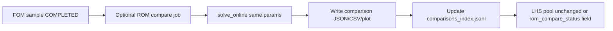

# M4 ROM integration status and plan

**Date:** 2026-06-05  
**Scope:** Read-only assessment + integration design. **No FEM physics changes.** **No mandatory ROM hook in FOM runs yet.**

---

## Executive summary

| Layer | Status |
|-------|--------|
| **M4 FOM production** | Working — `modes_catalog.jsonl` + LHS pool tracking |
| **Legacy ROM (`ROMManager`)** | Working offline/online — separate FOM engine, snapshot-based POD |
| **Bridge M4 FOM → ROM** | **Does not exist** |
| **ROM vs M4 FOM comparison** | **Does not exist** (only ad-hoc `ROMManager.compare` rerunning legacy FOM) |

Safest path: add a **read-only post-FOM ROM compare lane** that reads completed M4 aggregation outputs and runs legacy `solve_online` on the same LHS parameters, without blocking overnight FOM batches.

---

## Task A — ROM status report

### 1. What ROM code currently exists?

#### Core library

| Path | Role |
|------|------|
| `FEM/rom/rom_manager.py` | **`ROMManager`** — LHS pool, snapshot collection, POD basis, online solve, compare |
| `FEM/rom/__init__.py` | Re-exports `ROMManager` |

#### CLI / scripts

| Path | Role |
|------|------|
| `FEM/scripts/rom_pipeline.py` | Subcommands: `list-shapes`, `offline`, `build-basis`, `online`, `compare` |
| `FEM/scripts/run_pipeline.py` | Legacy master LHS path: `fem_master_dynamic` → tuner → `package_rom` → pool update |
| `FEM/scripts/package_rom.py` | Packages `selected_modes.csv` → CSR snapshot NPZ |
| `FEM/scripts/fem_rom_postprocess.py` | MMR prune / dominant tag labeling |
| `FEM/scripts/analyze_rom_stats.py` | Stats on tuner outputs |

#### GUI

| Path | Role |
|------|------|
| `gui/app.py` | Live ROM prediction via `ROMManager.solve_online`, STK ROM branch |

#### Shape / pool layout

| Path | Role |
|------|------|
| `ROM/classic/lhs_pool.json` | 500-sample LHS design pool (now also M4 production status fields) |
| `FEM/configs/rom_shapes.json` | Shape registry (`classic`, `dreadnought`) |
| `ROM/<shape>/snapshots/snapshot_*.npz` | Per-sample FOM mode snapshots (runtime, often gitignored) |
| `ROM/<shape>/reduced_basis.npz` | POD basis (required for online ROM) |

#### M4 FOM production (separate stack)

| Path | Role |
|------|------|
| `FEM/.../scripts/run_m4_production_pipeline.py` | LHS → M4 scout/L_prod/workers/aggregation |
| `pipeline_runs/guitars/<sample>/runs/<run_id>/aggregation/` | FOM outputs including `modes_catalog.jsonl` |

**There is no import edge from M4 scripts into `ROMManager` today.**

---

### 2. What inputs does ROM expect?

#### LHS parameters (7D sweep)

Flat keys in pool `entries[].parameters`:

```text
geometry.length, geometry.width, geometry.depth
geometry.top_thickness, geometry.hole_radius, geometry.back_thickness
top_wood_id, back_wood_id
```

M4 `sample_input.json` uses the same flat dotted keys — **compatible at parameter level**.

#### Offline collection (`collect_snapshots` / `run_pipeline`)

- Runs **legacy coupled FOM** (`fem_main_3d.run_fom_for_rom` or `fem_master_dynamic` path)
- Writes `ROM/<shape>/snapshots/snapshot_XXXX.npz` with:
  - `freqs_hz` / `frequencies`
  - `eigvecs_real` (dense) **or** CSR `ev_*` (package_rom path)
  - Optional: `participation_ratios`, `tag1_ratio`, `tag3_ratio`, `dominant_tag`

#### Basis build (`build_basis`)

- All `snapshot_*.npz` under one shape
- Stacks **every mode column** from every snapshot → SVD → `reduced_basis.npz`

#### Online solve (`solve_online`)

- `ROM/<shape>/reduced_basis.npz` must exist
- Same 7D `params` dict
- Assembles A,M via `assemble_coupled_operators_for_rom(cfg)` (legacy mesh/operators)
- Projects onto V, dense eigenproblem → `freqs_hz`

**ROM does not read `modes_catalog.jsonl`, M4 checkpoints, or `region_dof_indices.npz`.**

---

### 3. What outputs does ROM currently produce?

| Stage | Output |
|-------|--------|
| `offline` / `collect_snapshots` | `snapshot_*.npz`, pool entry `status=completed`, `snapshot_file=...` |
| `build-basis` | `reduced_basis.npz` (`basis`, `singular_values`, `energy_curve`, `selected_rank`, ...) |
| `online` / `solve_online` | `{ freqs_hz, elapsed_s, nev, num_basis_modes, basis_path }` |
| `compare` | `{ fom_freqs_hz, rom_freqs_hz, error_pct, fom_time_s, rom_time_s, speedup }` |
| GUI | Live frequency dashboard, ROM STK body JSON |

---

### 4. Does ROM already read LHS rows?

**Yes — legacy pool only.**

- `ROMManager._load_or_create_lhs_pool(shape)` reads `ROM/<shape>/lhs_pool.json`
- `collect_snapshots` iterates `entries` with `status=pending`
- `run_pipeline.py` updates pool after packaging one sample

**M4 production now also writes** `status`, `last_run_id`, `last_run_dir`, etc. into the same pool file. Legacy ROM code ignores `last_*` fields but can still read `parameters` and `status`.

**ROM does not read** `pipeline_runs/guitars/.../aggregation/` paths.

---

### 5. Does ROM already compare against FOM?

**Partially — wrong FOM for M4 comparison.**

`ROMManager.compare(shape, params, nev, fom_modes)`:

1. Runs **fresh legacy FOM** via `run_fom_for_rom` (not M4 aggregation)
2. Runs `solve_online` on same params
3. Pairs first `n` modes by index (not frequency matching)
4. Returns percent error vs legacy FOM frequencies

CLI:

```bash
python FEM/scripts/rom_pipeline.py compare --shape classic --nev 15 --set geometry.length=0.48
```

**No comparison against M4 `modes_catalog.jsonl` frequencies exists.**

---

### 6. What is missing to compare ROM vs new M4 FOM outputs?

| Gap | Detail |
|-----|--------|
| **FOM frequency source** | Need reader for M4 `modes_catalog.jsonl` (deduped `frequency_hz` list) or `modes_summary.json` |
| **Parameter source** | Read from `sample/sample_input.json` or LHS pool `entries[].parameters` |
| **Run linkage** | Map `sample_id` + `last_run_id` → aggregation dir |
| **Frequency matching** | M4 may have 500–600 modes; ROM returns `nev` modes — need greedy/nearest-neighbor matching in Hz, not index pairing |
| **Basis dependency** | `solve_online` still needs `reduced_basis.npz` built from **legacy** snapshots — M4 runs do not auto-refresh basis |
| **Operator parity** | M4 uses B3 ST shift-invert + adaptive targets; legacy ROM uses `assemble_coupled_operators_for_rom` — expect systematic bias until operators/meshes align |
| **Metadata comparison** | ROM has no concept of `radiation_proxy`, `coupling_class`, shares — frequency-only compare is phase 1 |
| **Batch index** | No `ROM/classic/comparisons/` index for overnight review |
| **Runtime compare** | M4 `runtime_summary.json` vs ROM `elapsed_s` — straightforward once wired |

---

### 7. Which files/functions should be modified? (future integration)

| Priority | File | Change |
|----------|------|--------|
| P0 | **New** `FEM/.../scripts/run_m4_rom_compare.py` | CLI: read completed LHS rows, load FOM catalog, run ROM, write comparison JSON/CSV/plot |
| P0 | **New** `FEM/.../scripts/v2_b3_m4_rom_fom_compare_lib.py` | Pure functions: load FOM freqs, match, metrics, plot |
| P1 | `FEM/rom/rom_manager.py` | Optional: `solve_online_from_params_file`, frequency-only export helper |
| P1 | `run_m4_production_pipeline.py` | Optional flag `--run-rom-compare` (off by default) |
| P2 | `gui/app.py` | Optional: display M4 FOM freqs alongside ROM for same params |
| P2 | `ROMManager.build_basis` | Future: ingest M4 mode columns (requires eigenvector export — **out of scope**, no full shapes) |

**Do not modify:** `v2_b3_st_sinvert_solver_lib.py`, checkpoint export, aggregation physics, participation/audio coupling compute paths.

---

### 8. What should remain unchanged?

- M4 FOM pipeline stages (scout → L_prod → workers → aggregation → freeze)
- FEM physics / solver math
- `modes_catalog.jsonl` field semantics
- Mandatory ROM inside FOM runs (keep opt-in)
- Full mode-shape storage policy
- Legacy `run_pipeline.py` until explicitly deprecated

---

### 9. Safest integration plan

**Phase 0 — This document + graceful FOM stop** ✅  
Report only; add `STOP_AFTER_CURRENT_SAMPLE` control (implemented).

**Phase 1 — Offline ROM/FOM frequency compare (recommended next)**  
New script, no FOM changes:

```bash
python FEM/.../scripts/run_m4_rom_compare.py \
  --lhs-json ROM/classic/lhs_pool.json \
  --shape classic \
  --completed-only \
  --max-samples 10
```

Per completed sample:

1. Read `last_run_dir` / `last_run_id` from LHS pool
2. Load FOM frequencies from `aggregation/modes_catalog.jsonl` (dedupe by `frequency_hz`)
3. Load parameters from `sample/sample_input.json` or pool entry
4. Call `ROMManager.solve_online(shape, params, nev=N)` (requires existing `reduced_basis.npz`)
5. Match ROM vs FOM frequencies (greedy nearest in Hz, one-to-one)
6. Write comparison artifacts (below)
7. Append to `ROM/classic/comparisons/index.jsonl`

**Phase 2 — Optional post-FOM hook**  
`run_m4_production_pipeline.py --run-rom-compare` runs Phase 1 after each COMPLETED sample (background subprocess, never fails FOM).

**Phase 3 — Basis / operator alignment**  
Separate study: rebuild `reduced_basis.npz` from expanded snapshot set; mesh/operator parity with M4.

**Phase 4 — Metadata-aware ROM/STK**  
Use M4 `top_share` / `radiation_proxy` for damping weights in STK (already documented for FOM catalog).

---

## Task B — ROM vs FOM comparison artifact design

### Per-sample outputs (proposed)

```text
ROM/classic/comparisons/<sample_id>__<run_id>_rom_fom_comparison.json
ROM/classic/comparisons/<sample_id>__<run_id>_rom_fom_comparison.csv
ROM/classic/comparisons/<sample_id>__<run_id>_rom_fom_frequency_plot.png
```

Global index:

```text
ROM/classic/comparisons/comparisons_index.jsonl
```

### JSON schema (`rom_fom_comparison_v1`)

```json
{
  "schema": "rom_fom_comparison_v1",
  "generated_utc": "2026-06-05T12:00:00Z",
  "sample_id": "sample_005",
  "lhs_row_index": 5,
  "shape_name": "classic",
  "parameters": {
    "geometry.length": 0.36,
    "top_wood_id": "mahogany"
  },
  "fom": {
    "run_id": "sample_005_m4prod1",
    "run_dir": "FEM/.../pipeline_runs/guitars/sample_005/runs/sample_005_m4prod1",
    "mode_count": 589,
    "frequencies_hz": [60.1, 66.2, "..."],
    "aggregation_status": "AGGREGATION_PASS",
    "runtime_s": 1234.5
  },
  "rom": {
    "basis_path": "ROM/classic/reduced_basis.npz",
    "nev_requested": 50,
    "nev_returned": 50,
    "frequencies_hz": [61.0, 67.1, "..."],
    "elapsed_s": 12.3
  },
  "matching": {
    "method": "greedy_nearest_hz_one_to_one",
    "max_pair_hz": 15.0,
    "pairs": [
      {
        "fom_hz": 220.5,
        "rom_hz": 221.1,
        "abs_error_hz": 0.6,
        "rel_error": 0.00272
      }
    ]
  },
  "metrics": {
    "pair_count": 48,
    "mean_abs_error_hz": 1.2,
    "median_abs_error_hz": 0.8,
    "max_abs_error_hz": 8.5,
    "mean_rel_error": 0.004,
    "median_rel_error": 0.003
  },
  "runtime": {
    "fom_wall_s": 1234.5,
    "rom_elapsed_s": 12.3,
    "speedup": 100.4
  },
  "status": "COMPARED",
  "warnings": []
}
```

### CSV columns

```text
sample_id,lhs_row_index,run_id,fom_hz,rom_hz,abs_error_hz,rel_error,coupling_class_fom
```

(`coupling_class_fom` optional join from catalog — phase 2)

### Frequency plot

- X: FOM frequency (or mode pair index)
- Y: absolute error Hz (bar/scatter)
- Overlay: FOM vs ROM frequency diagonal for matched pairs
- Title: `sample_005 / sample_005_m4prod1`

### Frequency matching algorithm (proposed)

```text
greedy_nearest_hz_one_to_one:
  Sort FOM freqs ascending
  For each FOM f (in order):
    Pick unused ROM frequency minimizing |rom - f|
    Accept if |rom - f| <= max_pair_hz (default 15 Hz, tunable)
    Else leave FOM unmatched
```

Report `pair_count`, unmatched FOM/ROM counts.

### Overnight workflow

```text
Night: run_m4_production_pipeline --execute --max-samples 10
Morning: run_m4_rom_compare --completed-only --max-samples 10
Review: ROM/classic/comparisons/*.json + plots + index.jsonl
```

---

## Task C — ROM integration proposal

### Target production flow (opt-in)



FOM path stays independent. ROM compare is **post-processing**.

### Proposed CLI (Phase 1 — new script)

```bash
python FEM/experiments/active_domain_validation/physics_integrity/scripts/run_m4_rom_compare.py \
  --lhs-json ROM/classic/lhs_pool.json \
  --shape classic \
  --completed-only \
  --max-samples 10 \
  --nev 80 \
  --max-pair-hz 15
```

| Flag | Purpose |
|------|---------|
| `--lhs-json` | Pool with `status=COMPLETED` |
| `--completed-only` | Skip non-completed entries |
| `--max-samples` | Limit batch |
| `--sample-id` | Single sample |
| `--nev` | ROM modes to request |
| `--max-pair-hz` | Matching tolerance |
| `--dry-run` | List what would be compared |

### Future hook in FOM runner (Phase 2 — not enabled yet)

```bash
python FEM/.../run_m4_production_pipeline.py \
  --execute --max-samples 10 \
  --run-rom-compare
```

Implementation: subprocess `run_m4_rom_compare.py --sample-id ...` after shared export; failures → warning only.

### LHS pool extension (optional Phase 2)

```json
{
  "last_rom_compare_status": "COMPARED",
  "last_rom_compare_utc": "...",
  "last_rom_mean_abs_error_hz": 1.2
}
```

---

## Task D — Graceful stop for production runner

### Implemented ✅

| Item | Path / command |
|------|----------------|
| Control file | `FEM/.../pipeline_runs/control/STOP_AFTER_CURRENT_SAMPLE` |
| Module | `scripts/v2_b3_m4_production_control.py` |
| Batch check | Between samples in `v2_b3_m4_lhs_production_batch.py` |

### Behavior

1. User requests stop while batch is running
2. **Current sample** completes fully (workers → aggregation → freeze → shared export → LHS update)
3. Before **next** sample starts, runner sees stop file and exits cleanly
4. `batch_execution_summary.json` includes `stopped_early: true`, `stop_reason: "STOP_AFTER_CURRENT_SAMPLE"`

### Commands

```bash
# Request stop (from another terminal while batch runs)
python FEM/.../scripts/run_m4_production_pipeline.py --request-stop

# Or manually
touch FEM/experiments/active_domain_validation/physics_integrity/pipeline_runs/control/STOP_AFTER_CURRENT_SAMPLE

# Clear before starting a new batch
python FEM/.../scripts/run_m4_production_pipeline.py --clear-stop

# Or
rm FEM/.../pipeline_runs/control/STOP_AFTER_CURRENT_SAMPLE
```

If stop file exists **before** a new `--execute` batch starts, the runner warns and exits without starting samples (use `--clear-stop` first).

Control directory is gitignored.

---

## Appendix — M4 FOM fields vs ROM (reference)

| M4 `modes_catalog.jsonl` | Legacy ROM |
|--------------------------|------------|
| `frequency_hz` | `freqs_hz` in snapshot/solve_online |
| `top_share`, `back_share`, `air_share` | Not used |
| `coupling_class`, `dominant_region` | `dominant_tag` (Top/Back only, different semantics) |
| `radiation_proxy`, `mic_output_proxy` | Not used |
| `bridge_excitation_coupling` | Not used |
| `modal_norm` | Not used |
| Eigenvectors | Snapshot `eigvecs_real` / CSR — **not** in M4 catalog |

Phase 1 ROM/FOM compare uses **frequencies only**. Metadata-weighted compare is Phase 4.

---

## Recommended approval checklist

Before implementing Phase 1 code:

- [ ] Confirm `ROM/classic/reduced_basis.npz` exists and is current enough for classic shape
- [ ] Confirm ≥1 M4 sample `COMPLETED` with `AGGREGATION_PASS` for pilot compare
- [ ] Approve comparison output location `ROM/classic/comparisons/`
- [ ] Approve matching method `greedy_nearest_hz_one_to_one` + default `max_pair_hz=15`
- [ ] Approve keeping ROM compare **outside** FOM runner until validated

**No FOM reruns required for this plan.**
