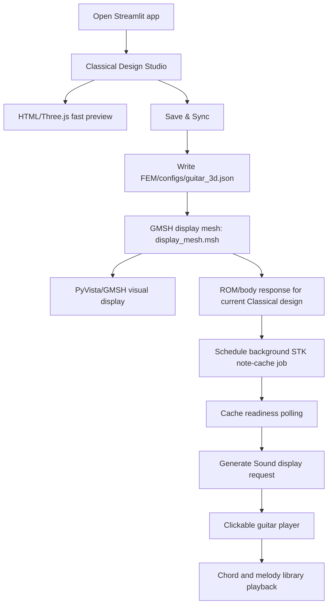

# Classical Guitar Current Technical Audit

Date: 2026-06-21

Scope: current repository behavior for the Classical-only website and its supporting
offline/full-pipeline code. This audit is source inspection only. No GMSH, FEM, ROM,
STK, WAV generation, simulations, or full tests were run.

## 1. Executive Technical Summary

1. The active website is Classical-only: the only exposed shape label is
   `Classical`, and it maps to the `classic` ROM namespace.
2. The active user inputs are a compact design/studio payload: length, width,
   depth, top thickness, soundhole radius, top wood, and back wood.
3. The HTML/Three.js fast preview is an immediate visual design preview; it does
   not run FEM, ROM, STK, or mesh generation.
4. Save & Sync writes the current design into the GMSH config and regenerates the
   display mesh used by the PyVista/GMSH viewport.
5. The display mesh is a UI visualization mesh. It is explicitly separate from
   the full FOM/solver mesh.
6. After Save & Sync, the website can run the ROM/body-response stage for the
   current Classical design, then schedule STK note-cache preparation.
7. The normal website does not run a full FEM solve on each Generate Sound click.
   Full FEM/FOM machinery exists in the repository, but the active website flow
   uses the reduced/surrogate path for responsive interaction.
8. The ROM path used by the website includes an M4 modal surrogate for `classic`
   with a manifest listing Classical training samples.
9. STK note-cache generation is background, cached by a parameter hash, and uses
   the current Classical contrast preset `strong` for new builds.
10. Generate Sound is display intent only: it requests the interactive player and
    waits for a playable cache. It does not restart the computation chain.
11. The clickable guitar player loads cached note WAVs through string/fret
    position aliases, preserving the existing fretboard map.
12. Chords and melodies are JSON-driven UI playback sequences over the same cached
    string/fret WAV mapping; they do not synthesize new audio in the browser.
13. Body sound is a hybrid physical/perceptual STK parameterization: geometry,
    woods, ROM/modal data, damping/Q/tau, radiation, bridge/coupling, and identity
    contrast affect the generated note cache.
14. BOX and ACOUSTIC code exists in shape-aware/offline modules, but it is hidden
    from the active website UI and should be treated as experimental/inactive.
15. The main honest boundary: this is not a real-time full FEM solver in the
    browser. It is a design -> mesh/ROM/body response -> cached STK note library
    -> interactive playback system.

Key source references:

| Claim | Source |
| --- | --- |
| Classical-only website shape | `gui/app.py`, module constants, lines 61-63 |
| Studio payload keys | `gui/app.py`, `STUDIO_ROM_KEYS`, lines 322-331 |
| Payload sanitization and CLASSIC forcing | `gui/app.py`, `sanitize_studio_payload`, lines 353-405 |
| Save & Sync event flow | `gui/app.py`, `process_fast_preview_event`, lines 714-785 |
| Display mesh generation | `gui/app.py`, `regenerate_display_mesh`, lines 816-846; `run_gmsh_display`, line 1077 |
| ROM/STK chain after Save & Sync | `gui/app.py`, `_render_main_studio`, lines 2035-2048 |
| Generate Sound player intent | `gui/stk_app_ui.py`, `request_generate_guitar`, lines 398-466 |
| STK default preset | `gui/stk_app_audio_service.py`, `DEFAULT_WEBSITE_CLASSIC_CONTRAST_PRESET`, line 92 |

## 2. Current Website Flow: Exact Runtime Sequence

### Runtime sequence diagram



### Stage details

| Stage | Trigger | Inputs | Outputs | Code | Timing/state |
| --- | --- | --- | --- | --- | --- |
| App startup | Streamlit imports `gui/app.py` | Repository config files and session state defaults | Classical-only page state | `gui/app.py`, constants lines 20-70, `main`, line 2123 | Streamlit runtime |
| Shape scope | App initialization | `CLASSIC_SHAPE_LABEL` | `SHAPE_OPTIONS = ("Classical",)` | `gui/app.py`, lines 61-63 | Active |
| Design controls | User edits studio controls | Studio payload | Sanitized design payload | `gui/app.py`, `sanitize_studio_payload`, lines 353-405 | Immediate |
| Fast HTML preview | Studio payload changes | length, width, depth, woods, hole radius | Browser-side preview | `gui/app.py`, `_render_main_studio`, lines 1823-1927; `gui/components/fast_preview` | Immediate UI |
| Save & Sync | Fast preview event `save_sync` | Current design payload | Config write, display mesh regeneration, ROM pending flag | `gui/app.py`, `process_fast_preview_event`, lines 714-785 | Synchronous display-mesh step |
| Config write | Save & Sync | Geometry/materials | `FEM/configs/guitar_3d.json` | `gui/app.py`, `save_config`, lines 1010-1041 | File write |
| GMSH display | Save & Sync | Config JSON | `FEM/mesh/display_mesh.msh` | `gui/app.py`, `_gmsh_cmd`, lines 1043-1045; `_run_gmsh`, lines 1047-1069; `run_gmsh_display`, line 1077 | External GMSH process when run by app |
| GMSH viewport | Mesh exists | `display_mesh.msh` | Rendered PyVista mesh image | `gui/app.py`, `render_validation_mesh_viewport`, lines 1202-1265; `get_view_mesh`, lines 1277-1285 | Cached UI rendering |
| ROM/body response | Save & Sync produced ready display mesh and `rom_body_pending` | LHS parameters, current shape | STK body JSON and session readiness | `gui/app.py`, `complete_rom_body_response`, lines 1366-1394; `_render_main_studio`, lines 2035-2048 | Triggered by active page flow |
| STK scheduling | ROM/body response ready | LHS params, ROM fingerprint | Background STK note-cache job status | `gui/app.py`, `schedule_stk_note_library_after_rom`, lines 1397-1419; `gui/stk_app_audio_service.py`, `start_background_note_library_job`, lines 2152-2250 | Background subprocess |
| STK polling | Render request or active watch panel | Job JSON, report JSON, preview cache | Running/ready/failed status | `gui/stk_app_ui.py`, `poll_stk_render_request`, lines 283-358; `render_stk_render_watch_panel`, lines 361-393 | Polling/fragment |
| Generate Sound | User button click | Current hash/cache state | Player request/session latch | `gui/stk_app_ui.py`, `_set_stk_render_request`, lines 270-280; `request_generate_guitar`, lines 398-466 | Display intent only |
| Player activation | Cache ready and requested | Current preview cache | `active_stk_player_payload` and stable player key | `gui/stk_app_ui.py`, `generate_or_load_ready_guitar`, lines 165-253; `apply_stk_activation_to_session`, lines 79-100 | Cached activation |
| Player render | Active payload exists | Runtime cache WAVs, guitar library JSON | Interactive fretboard and library UI | `gui/app.py`, player call lines 2056-2103; `gui/components/guitar_player/__init__.py`, `guitar_player`, line 34 | Browser component |
| Chords/melodies | User clicks library controls | `chords.json`, `melodies.json`, current position map | Timed playback of cached WAVs | `gui/guitar_library.py`, `load_guitar_library`, line 138; `gui/components/guitar_player/index.html`, `playChord`, line 837; `playMelody`, line 857 | Browser-side scheduling |

Important precision: the source shows Save & Sync marks ROM/body work pending and,
after ROM readiness, schedules STK note-cache preparation. Generate Sound records a
display request and activates the player when the cache is playable; it is not the
computation starter.

## 3. Current Classical-Only Scope

Confirmed active scope:

| Item | Current behavior | Source |
| --- | --- | --- |
| User-visible shape | Only `Classical` | `gui/app.py`, lines 61-63 |
| ROM namespace | Always `classic` | `gui/app.py`, `rom_namespace`, lines 879-881 |
| Main app saved shape | Forced to `Classical` | `gui/app.py`, `main`, line 2123 |
| Studio payload shape | Sanitizer overwrites shape to `Classical` | `gui/app.py`, `sanitize_studio_payload`, lines 353-357 |
| BOX/ACOUSTIC UI | Not exposed in `SHAPE_OPTIONS` | `gui/app.py`, lines 61-63 |

Available but inactive code:

| Code area | What exists | Current website status |
| --- | --- | --- |
| Shape registry | `classic`, `box`, `acoustic` registry entries | Available for offline/experimental paths |
| BOX/ACOUSTIC geometry aliases | STEP mapping supports box/acoustic/classic | Hidden from active website UI |
| FOM/developer branches | Full FOM and developer buttons/modes exist in code | Not the normal active user path |

References:

```text
FEM/scripts/m4_shape_registry.py
M4ShapeConfig and registry construction
shape registry definitions, approximately lines 1-170

FEM/geometry/build_3d_guitar.py
STEP mapping and shape alias logic
module header and reference mapping, lines 1-23
```

## 4. User-Visible Parameters and Internal Variables

### Active design inputs

| User input | Internal key | Current role |
| --- | --- | --- |
| Length | `length`, `geometry.length` | Visual body length, GMSH config, ROM/LHS input, STK sample parameter |
| Width | `width`, `geometry.width` | Visual body width and derived bout/waist values, GMSH config, ROM/LHS input, STK sample parameter |
| Depth | `depth`, `geometry.depth` | Visual/body depth, GMSH config, ROM/LHS input, STK body factor |
| Top thickness | `top_thickness`, `geometry.top_thickness` | GMSH/material config, ROM/LHS input, STK stiffness/damping proxies |
| Soundhole radius | `hole_radius`, `geometry.hole_radius` | Visual soundhole, GMSH soundhole, ROM/LHS input, STK radiation/Helmholtz proxy |
| Top wood | `top_wood_id`, `materials.top.wood_id` | Material lookup, color/preview, STK material factors |
| Back wood | `back_wood_id`, `materials.back.wood_id` | Material lookup, color/preview, STK warmth/material factors |

Source references:

```text
gui/app.py
rom_lwd_bounds
lines 263-269

gui/app.py
rom_defaults
lines 271-279

gui/app.py
STUDIO_ROM_KEYS
lines 322-331

gui/app.py
lhs_params_from_ui
lines 869-878
```

### Derived geometry variables

The website computes helper values for visual/GMSH state, including lower bout,
upper bout, waist, soundhole location, bridge location, and derived back thickness.
These are derived from the active L/W/D/top-thickness/hole-radius payload; they are
not additional independent user controls.

```text
gui/app.py
build_geometry_state
lines 282-310

gui/app.py
m4_parameters_from_ui
lines 907-923
```

The sanitization layer also removes legacy bout/waist payload keys and clamps the
hole radius to bounds and to a fraction of the body dimensions.

```text
gui/app.py
sanitize_studio_payload
lines 353-405
```

### Hashes and readiness state

The app tracks geometry/material fingerprints, ROM/body fingerprints, parameter
hashes, STK job status, and active player payload/cache state in Streamlit
session state. Save & Sync or parameter changes clear stale audio/player state.

```text
gui/app.py
invalidate_rom_and_audio_state
lines 1294-1328

gui/stk_app_ui.py
apply_stk_activation_to_session
lines 79-100
```

## 5. Geometry and Meshing Layers

### Fast HTML/Three.js preview

Role: immediate design preview. It visualizes the current design/studio payload and
emits events such as parameter changes and Save & Sync. It is a UI component, not a
solver.

Source references:

```text
gui/app.py
_render_main_studio
lines 1823-1927

gui/components/fast_preview
HTML/JS component assets
```

### GMSH display mesh

Role: visual verification mesh for the website. It is produced by Save & Sync and
shown in the PyVista/GMSH viewport.

Key details confirmed from source:

| Detail | Source |
| --- | --- |
| Display output path is `FEM/mesh/display_mesh.msh` | `gui/app.py`, line 29 |
| Display generation uses `FEM_ALLOW_DISPLAY=1` | `gui/app.py`, `run_gmsh_display`, line 1077 |
| Viewer loads `display_mesh.msh`, not the FOM mesh | `gui/app.py`, `get_view_mesh`, lines 1277-1285 |
| Viewer caption says display mesh is separate from engineering FOM mesh | `gui/app.py`, `render_validation_mesh_viewport`, lines 1202-1265 |
| Display branch in geometry script is explicitly for PyVista display shell | `FEM/geometry/build_3d_guitar.py`, lines 393-415 |
| Display target size constants exist separately from FOM refinement | `FEM/geometry/build_3d_guitar.py`, `DISPLAY_GLOBAL_LC_M` and `DISPLAY_SEAM_LC_M`, around lines 513-514 |

### Full FEM/FOM mesh

Role: offline/developer/full physics mesh. It is not the normal Generate Sound
button behavior.

```text
gui/app.py
run_gmsh_fom
line 1081

FEM/geometry/build_3d_guitar.py
FEM_ALLOW_FOM branch and mesh-size field logic
approximately lines 393-415 and 531-617
```

### Physical tags

The geometry script creates physical groups for top, soundhole, back, ribs, wood
fix/support, and volumes including air.

```text
FEM/geometry/build_3d_guitar.py
physical group definitions
approximately lines 3817-3918
```

Observed tag protocol from source comments:

| Tag | Meaning |
| --- | --- |
| 1 | Top |
| 2 | Soundhole |
| 3 | Back |
| 4 | Ribs |
| 5 | wood_fix/support |
| 10 | Air_Internal volume |

## 6. Full FEM / FOM Model

This section describes available full-pipeline code, not the normal website
Generate Sound operation.

### Mesh and tags

The full FEM code loads a GMSH mesh, converts or reads physical cell/facet tags,
and validates the required air/wood tags.

```text
FEM/scripts/fem_main_3d.py
_generate_mesh_with_gmsh
lines 277-299

FEM/scripts/fem_main_3d.py
_convert_msh_to_xdmf_with_meshio
lines 302-349

FEM/scripts/fem_main_3d.py
_load_mesh_with_fallback and _load_mesh_and_tags
lines 352-417
```

### Structural model

The structural shell/wood model uses orthotropic plate stiffness terms for top and
back materials and shell stiffness forms over tagged shell regions.

```text
FEM/scripts/fem_main_3d.py
_orthotropic_plate_stiffness
lines 484-539

FEM/scripts/fem_main_3d.py
_orthotropic_shell_stiffness_form
starts line 577
```

Material notation note: `E_T` appears as transverse modulus in the orthotropic
material model. It is not a user-facing website parameter named `T`.

### Acoustic and FSI model

The full coupled path includes acoustic pressure DOFs, soundhole pressure-release
handling, FSI interface forms, and diagnostics for coupling block norms and mixed
DOF maps.

```text
FEM/scripts/fem_main_3d.py
soundhole and pressure BC helpers
approximately lines 765-938

FEM/scripts/fem_main_3d.py
_fsi_coupling_interface_forms and _fsi_coupling_interface_forms_v2
lines 989-1057

FEM/scripts/fem_main_3d.py
_fsi_nitsche_interface_forms
starts line 1060

FEM/scripts/fem_main_3d.py
_audit_mixed_coupling_matvec_alignment and related diagnostics
approximately lines 1291-1675
```

### Eigenproblem and solver

The full coupled solve is a generalized non-Hermitian eigenproblem path using
SLEPc/PETSc. The source distinguishes physical lambda interpretation and
shift-invert target behavior.

```text
FEM/scripts/fem_main_3d.py
_slepc_physical_lambda
lines 2134-2196

FEM/scripts/fem_main_3d.py
_slepc_eps_strategy
lines 2218-2282

FEM/scripts/fem_main_3d.py
_solve_coupled_evp
starts line 6046

FEM/scripts/fem_main_3d.py
EPS setup, target, shift-invert, solve, harvest
lines 4426-4848 and 4989 onward
```

Confirmed solver traits from source:

| Trait | Source |
| --- | --- |
| Coupled path uses `SLEPc.EPS.ProblemType.GNHEP` | `FEM/scripts/fem_main_3d.py`, line 4426 |
| Shift-invert path uses `SLEPc.ST.Type.SINVERT` | `FEM/scripts/fem_main_3d.py`, lines 4478 and 4713 |
| Target is set on EPS | `FEM/scripts/fem_main_3d.py`, lines 4710-4711 |
| Converged eigenpairs are harvested with `eps.getEigenpair` | `FEM/scripts/fem_main_3d.py`, line 4989 |

## 7. Meaning of Internal Labels

This section only states what is supported by source inspection.

| Label | Current meaning in repository | Active website? | Source |
| --- | --- | --- | --- |
| GMSH | Geometry and mesh generation backend for display and FOM meshes | Display mesh is active on Save & Sync | `gui/app.py`, `_gmsh_cmd`, lines 1043-1045; `FEM/geometry/build_3d_guitar.py` |
| ROM | Reduced-order/model-surrogate path used for responsive body/modal response | Active in website body-response chain | `gui/app.py`, `complete_rom_body_response`, lines 1366-1394 |
| FOM/FEM | Full finite-element model and full-order simulations | Available offline/developer; not normal Generate behavior | `FEM/scripts/fem_main_3d.py`, `run_fem_3d_simulation`, line 9852 |
| FSI | Fluid-structure interaction between wood displacement and air pressure | Full-pipeline capability | `FEM/scripts/fem_main_3d.py`, FSI helpers lines 989-1155 |
| Active domain | Operator/DOF restriction concepts in full solver code | Offline/full-pipeline capability | `FEM/scripts/fem_main_3d.py`, active-set restriction around lines 7679-7716 |
| Physical integrity | Diagnostics/audit scripts and solver checks for physical plausibility | Offline/developer validation | `FEM/experiments/active_domain_validation/physics_integrity` and diagnostics in `fem_main_3d.py` |
| V2/B3 | Internal experimental/evolution labels in solver/physics-integrity code | Not user-facing | `FEM/scripts/fem_main_3d.py`, `_B3_operator_build_profiler`, lines 76-80; v2 FSI core lines 1025-1057 |
| M4 | Current modal surrogate/model manifest for Classical ROM | Active as website ROM asset | `ROM/classic/rom_model_manifest.json`, schema/model fields |
| Stage 5.1H | STK pipeline final-candidate naming in defaults | Active as STK mode label/default source | `gui/stk_pipeline_defaults.py`, module docstring and constants, lines 1-30 |
| V4.1 identity | Body identity/contrast feature space used by STK pipeline defaults | Active through STK default imports when required by mode | `gui/stk_pipeline_defaults.py`, imports and `enrich_sample_parameters_for_note`, lines 7-18 and 106-132 |
| Modal body/body transfer | Modal/physical body-response data exported into STK synthesis | Active in STK preparation | `gui/pgsm_stk_parameter_export.py`, required render groups and factor catalog, lines 87-112 and 552-584 |
| Identity contrast | Bounded STK contrast layer using existing physical/design-derived features | Active default preset is `strong` | `gui/stk_app_audio_service.py`, line 92; `gui/pgsm_stk_parameter_export.py`, lines 116-122 |
| T | In inspected active code, not a standalone pipeline label. It appears in material notation such as `E_T` and in variable names like top thickness. | No user-facing `T` control found | `FEM/scripts/fem_main_3d.py`, `_orthotropic_plate_stiffness`, lines 484-539 |

## 8. ROM, Surrogate, and Modal Response

### Active website ROM path

The website builds an LHS-like parameter dictionary from the design payload and
uses it for M4/ROM prediction and STK body preparation.

```text
gui/app.py
lhs_params_from_ui
lines 869-878

gui/app.py
m4_parameters_from_ui
lines 907-923

gui/app.py
complete_rom_body_response
lines 1366-1394
```

The manifest for `ROM/classic` identifies the active backend as `m4_surrogate` and
lists Classical training samples.

```text
ROM/classic/rom_model_manifest.json
schema/model/training metadata
top of file
```

Confirmed manifest fields from inspection:

| Field | Value observed |
| --- | --- |
| `schema` | `m4_rom_model_manifest_v2` |
| `shape_name` | `classic` |
| `active_backend` | `m4_surrogate` |
| `model_version` | `m4_modal_surrogate_v2_1_intensity` |
| `training_sample_ids` | Begins `sample_000` through `sample_065` in manifest excerpt |

### Legacy/dynamic ROM manager

The repository also contains a ROM manager that can collect snapshots, build an
SVD basis, project full operators, and solve a reduced eigenproblem. This is
offline/full-pipeline capability and should not be confused with the normal
Generate Sound button.

```text
FEM/rom/rom_manager.py
build_basis
lines 916-954

FEM/rom/rom_manager.py
solve_online
lines 990-1021
```

## 9. STK Sound Generation Pipeline

### Scheduling and cache building

The website schedules note-cache generation only after ROM/body data is ready.
The background command calls `tools/build_app_stk_note_library.py` with supported
arguments such as sample id, shape type, cache dir, parameter hash, render mode,
parallel workers, repo root, priority notes, and contrast preset.

```text
gui/app.py
schedule_stk_note_library_after_rom
lines 1397-1419

gui/stk_app_audio_service.py
build_note_library_startup_command
lines 2110-2149

tools/build_app_stk_note_library.py
argparse CLI
lines 32-120
```

The unsupported `--instrument` argument is not present in the current startup
command path.

### Current STK defaults

| Default | Source |
| --- | --- |
| Website contrast preset is `strong` | `gui/stk_app_audio_service.py`, line 92 |
| Render mode defaults to `parallel_batch` | `config/app_stk_config.py`, defaults lines 10-26; `config/app_stk_config.json` |
| Parallel workers default to 3 | `config/app_stk_config.py`, defaults lines 10-26; `config/app_stk_config.json` |
| Default duration is 4.5 s | `config/app_stk_config.py`, defaults lines 10-26; `config/app_stk_config.json` |
| Fret count is 19 | `config/classical_guitar_fretboard.json`; `config/app_stk_config.json` |

### What determines note sound

The STK parameter export layer maps geometry, material, modal, and identity inputs
into renderer groups. The following sound factors are explicitly represented in
source:

| Factor category | Examples from source | Source |
| --- | --- | --- |
| Geometry/cavity | body depth, volume proxy, soundhole area, Helmholtz/radiation proxy | `gui/pgsm_stk_parameter_export.py`, scalar keys lines 96-112; derived factors lines 220-238 |
| Woods/materials | top/back weights, damping, stiffness-to-weight, material loss, warmth | `gui/pgsm_stk_parameter_export.py`, scalar keys lines 96-112 |
| Decay/damping | string decay, modal Q/tau, material loss, radiation brightness | `gui/pgsm_stk_parameter_export.py`, `_string_decay`, lines 428-435; factor catalog lines 552-584 |
| Body/string mix | string body mix, direct string gain, body modal gain, send scale | `gui/pgsm_stk_parameter_export.py`, factor catalog lines 552-584; mix scale keys around lines 782-788 |
| Brightness/radiation | harmonic brightness, radiation weights, soundhole radiation | `gui/pgsm_stk_parameter_export.py`, `_harmonic_brightness`, lines 437-441; `_radiation_weights`, lines 478-498 |
| Modal response | modal bank frequencies, gains, tau, participation | `gui/pgsm_stk_parameter_export.py`, `_modal_bank`, lines 449-477 |
| Identity contrast | off/conservative/strong/aggressive values | `gui/pgsm_stk_parameter_export.py`, lines 116-122 |

### Parallel batch finalization

The current cache builder includes a parallel staging finalization path and
position-alias creation, so the final runtime cache is expected to contain both
note WAVs and string/fret aliases.

```text
gui/stk_app_audio_service.py
finalize_parallel_staging_cache
starts line 1102

gui/stk_app_audio_service.py
ensure_position_wav_aliases
starts line 2637
```

## 10. Clickable Guitar Player, Note Map, Chords, and Melodies

### Fretboard mapping

The fretboard config defines standard classical guitar tuning and a 19-fret
map. The player uses string/fret position WAV aliases rather than synthesizing
audio in the browser.

```text
config/classical_guitar_fretboard.json
tuning, fret_count, generated_fretboard
top of file

gui/stk_app_audio_service.py
build_stk_player_payload
starts line 2797

gui/stk_app_audio_service.py
validate_stk_player_runtime_cache
starts line 2852
```

With 6 strings and frets 0-19, the player exposes 120 string/fret positions. The
unique required note set is derived by source code from that map rather than being
hardcoded in the UI.

### Player behavior

The browser player preloads and plays cached WAV files, manages overlapping voices,
and applies existing ducking/fade behavior.

```text
gui/components/guitar_player/index.html
MAX_OVERLAPPING_VOICES and ducking constants
lines 494-498

gui/components/guitar_player/index.html
playNoteWav and playPosition
lines 624-650

gui/components/guitar_player/index.html
renderPlayer
starts line 958
```

### Chord and melody library

The JSON library is loaded and validated in Python, then passed to the player
component. Chords schedule multiple string/fret positions with a small inter-string
gap; melodies schedule timed note events by beat.

```text
gui/guitar_library.py
validate_chord_library
line 62

gui/guitar_library.py
validate_melody_library
line 90

gui/guitar_library.py
load_guitar_library
line 138

gui/components/guitar_player/index.html
playChord
line 837

gui/components/guitar_player/index.html
playMelody
line 857

gui/components/guitar_player/index.html
renderLibrary
line 898
```

The current chord playback gap was intentionally adjusted in data, not player
logic:

```text
gui/data/guitar_library/chords.json
playback_defaults.inter_string_gap_ms
current value: 4
```

## 11. Important Files and Responsibilities

| File/path | Responsibility |
| --- | --- |
| `gui/app.py` | Main Streamlit app, Classical-only scope, Design Studio, Save & Sync, display mesh viewport, ROM/STK orchestration, player mount |
| `gui/stk_app_ui.py` | Generate Sound request state, cache activation, player session latching, STK status precedence |
| `gui/stk_app_audio_service.py` | STK cache state, background job command, readiness checks, finalization, position aliases, player payload validation |
| `gui/pgsm_stk_parameter_export.py` | Physical/design/modal parameters exported to STK renderer, contrast preset factors |
| `gui/stk_pipeline_defaults.py` | Website STK mode aliases and identity context enrichment |
| `gui/guitar_library.py` | Chord/melody JSON loading and validation |
| `gui/components/guitar_player/index.html` | Browser fretboard, cached-WAV playback, chord and melody controls |
| `gui/components/fast_preview` | Browser design preview component |
| `FEM/geometry/build_3d_guitar.py` | GMSH geometry and mesh generation for display and FOM paths |
| `FEM/scripts/fem_main_3d.py` | Full FEM/FOM coupled model, FSI forms, SLEPc solves, physical diagnostics |
| `FEM/rom/rom_manager.py` | Offline ROM snapshot/basis/online projection capability |
| `ROM/classic/rom_model_manifest.json` | Current Classical M4 surrogate manifest |
| `config/app_stk_config.py` and `.json` | STK app defaults and runtime config |
| `config/classical_guitar_fretboard.json` | String/fret/note map |
| `tools/build_app_stk_note_library.py` | Offline/background note-cache builder CLI |

## 12. Validation, Diagnostics, and Reliability Checks

| Check | What it prevents or detects | Artifact/report | Active website or offline |
| --- | --- | --- | --- |
| Studio payload sanitization | Invalid/out-of-scope shape, woods, or dimensions | Session payload | Active |
| Config write and display mesh generation | Ensures current design is written before display mesh | `FEM/configs/guitar_3d.json`, `display_mesh.msh` | Active on Save & Sync |
| Display mesh viewport load | Prevents showing absent mesh silently | User visible warning/status | Active |
| ROM body readiness | Prevents STK scheduling without body response | Session state and `FEM/outputs/rom_stk_body.json` | Active |
| STK job idempotency/readiness | Avoids restarting ready/running jobs for same hash | Job JSON/background JSON/report JSON | Active |
| Cache readiness validation | Ensures required notes/position WAVs exist | Cache report and session status | Active |
| Player runtime validation | Prevents mounting unusable cache | Validation payload/session state | Active |
| Guitar library JSON validation | Catches invalid chord/melody string/fret/note data | Python validation errors before component render | Active |
| FSI block audits | Detects missing/weak coupled FEM blocks | Logs/diagnostic payloads | Offline/full-pipeline |
| Physical integrity scripts | Audit experimental solver/shape behavior | Experiment logs/catalogs | Offline/VM validation |
| Contrast diagnostic workflow | Compares cached guitars in listening WAVs | `audio/diagnostics` reports | Offline only |

References:

```text
gui/app.py
sanitize_studio_payload, invalidate_rom_and_audio_state, rom_body_response_ready
lines 353-405, 1294-1328, 1339-1351

gui/stk_app_audio_service.py
refresh_stk_background_job_status
starts line 1894

gui/stk_app_audio_service.py
validate_stk_player_runtime_cache
starts line 2852

gui/guitar_library.py
validation functions
lines 62 and 90

FEM/scripts/fem_main_3d.py
FSI and solver diagnostics
multiple helper ranges, especially lines 1160-1675 and 2297-2315
```

## 13. Current Limitations and Honest Boundaries

1. The active website is not running a real-time full FEM solve for every user
   interaction. It uses a reduced/surrogate Classical path plus cached STK notes.
2. The fast HTML preview is visual-only. It is useful for immediate design feedback
   but is not the scientific mesh.
3. The GMSH display mesh is a UI validation/visualization mesh. The engineering
   FOM mesh is separate.
4. Full FEM/FSI code exists and is sophisticated, but the active website path is
   designed for responsiveness and cache reuse.
5. ROM/M4 predictions are reduced or surrogate outputs derived from previous
   Classical training data; they are not fresh full-order solves on Generate Sound.
6. STK audio generation is physical/perceptual synthesis driven by available
   geometry, material, modal, and identity data. It is not a direct acoustic
   recording and not a fully coupled time-domain FEM audio simulation.
7. The interactive player depends on cached WAV assets. If cache generation is not
   complete, the player cannot honestly play that design yet.
8. Chords and melodies are playback sequencing over existing note WAVs. They do
   not create new physical simulations.
9. BOX and ACOUSTIC code should not be presented as active final features. They are
   present in the repo but hidden/frozen for website use.
10. Source inspection cannot prove runtime success in the VM. VM validation remains
    the authority for real jobs, cache contents, and UI behavior.

## 14. Presentation-Ready Explanation Map

### A. One-Minute Explanation

The website lets a user design a Classical guitar by changing dimensions, wood
choices, top thickness, and soundhole size. The app shows an instant visual preview,
then Save & Sync builds a GMSH display mesh and prepares a reduced body/modal
response for that design. A background STK process renders a cache of playable note
WAVs using the computed body response and material/geometry factors. When the user
clicks Generate Sound, the clickable fretboard opens once the cache is ready. Chords
and melodies are then played by sequencing the same cached string/fret WAVs.

### B. Five-Minute Technical Explanation

```text
Design input
-> geometry/studio payload
-> fast visual preview
-> Save & Sync
-> GMSH display mesh
-> ROM/M4 modal/body response
-> STK parameter preparation
-> background note-cache generation
-> cached note and string/fret WAV aliases
-> interactive fretboard, chord, and melody playback
```

1. The user controls a small set of physically meaningful Classical guitar
   parameters: length, width, depth, top thickness, hole radius, and woods.
2. The app sanitizes those values, keeps the shape Classical-only, and derives
   helper geometry for display and model inputs.
3. The fast preview gives immediate visual feedback in the browser.
4. Save & Sync writes the current design to the GMSH config and generates a
   display mesh.
5. The app computes or loads a reduced/modal body response for the current design.
6. STK note-cache generation is scheduled in the background and keyed by the
   design parameter hash.
7. The STK layer maps design, material, modal, damping, radiation, and body identity
   factors into note WAVs.
8. The player validates the cache and exposes a standard-tuned 19-fret Classical
   fretboard.
9. Chord and melody buttons are JSON-driven sequences over the same validated
   string/fret map.
10. Full FEM/FSI capability exists for offline or developer validation, but the
    final website experience is a cached reduced/synthesis pipeline for stability.

### Likely Examiner Questions

1. **Is the website solving a full FEM model every time I click a note?**  
   No. Notes are played from cached STK WAV files generated for the current design.

2. **Does Save & Sync directly play sound?**  
   No. Save & Sync updates the design/config/display mesh and enables the ROM/STK
   preparation chain. Generate Sound controls player display intent.

3. **What makes two guitars sound different?**  
   Geometry, woods, top thickness, soundhole radius, ROM/modal response, damping,
   radiation, bridge/body coupling proxies, and the bounded identity contrast layer.

4. **Are BOX and ACOUSTIC available in the final website?**  
   No. Their code exists, but the active UI is Classical-only.

5. **What is physically modeled?**  
   The full repository includes GMSH geometry, FEM/FSI forms, and ROM/surrogate
   modal response. The website uses the reduced/surrogate and STK synthesis path.

6. **What is visual-only?**  
   The fast HTML preview and display mesh viewport are visual feedback. The display
   mesh is not the solver mesh.

7. **How does the player know which WAV to play for each fret?**  
   It uses the standard tuning/fretboard map and position aliases such as string/fret
   WAV entries created in the runtime cache.

8. **Are chords physically re-rendered as chords?**  
   No. Chord playback schedules individual cached string/fret note WAVs with a small
   strum offset.

9. **What validates that the player cache is usable?**  
   Python-side readiness and runtime-cache validation check required note/position
   WAVs before activating the player payload.

10. **What should not be claimed?**  
    Do not claim real-time full FEM audio synthesis, measured acoustic validation,
    or final-ready BOX/ACOUSTIC behavior unless VM/runtime evidence is provided.

## Source Inspection Log

Files inspected for this audit:

- `CODEX_HANDOFF.md`
- `gui/app.py`
- `gui/stk_app_ui.py`
- `gui/stk_app_audio_service.py`
- `gui/pgsm_stk_parameter_export.py`
- `gui/stk_pipeline_defaults.py`
- `gui/guitar_library.py`
- `gui/components/guitar_player/index.html`
- `gui/components/guitar_player/__init__.py`
- `config/app_stk_config.py`
- `config/app_stk_config.json`
- `config/classical_guitar_fretboard.json`
- `tools/build_app_stk_note_library.py`
- `FEM/geometry/build_3d_guitar.py`
- `FEM/scripts/fem_main_3d.py`
- `FEM/rom/rom_manager.py`
- `FEM/scripts/m4_shape_registry.py`
- `ROM/classic/rom_model_manifest.json`
- `FEM/configs/guitar_3d.json`

Inspection commands were lightweight file reads/searches only (`Get-Content`,
`Select-String`, `rg`, `git status`). No runtime validation was attempted.
